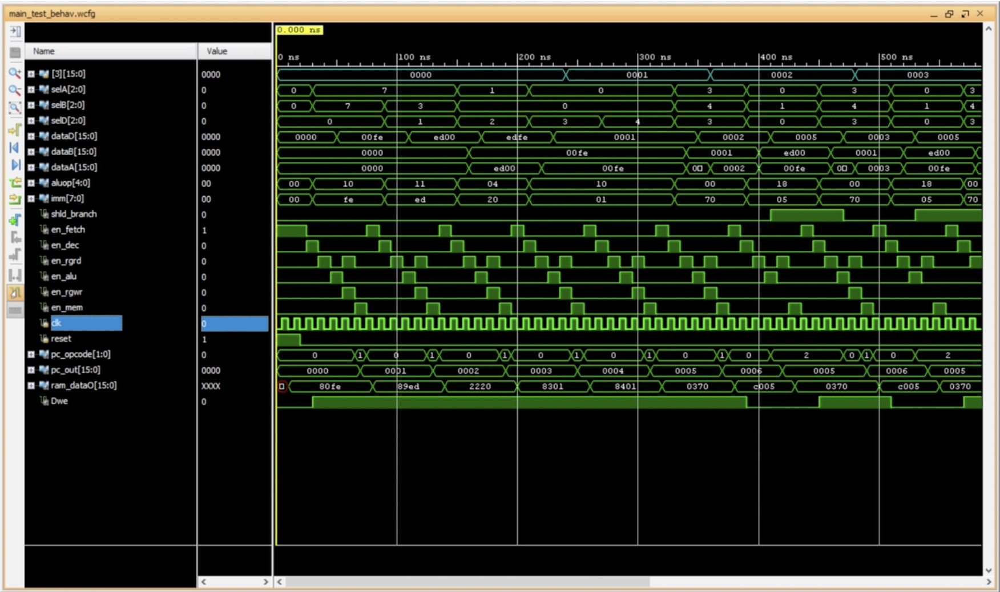

# FPU
_yes I know that FPU also stands for Floating Point Unit, I am just lazy to change the name_
An verilog implementation of a 16 bit processor, codenamed FPGA processing unit. This implements a simple prototype processor with a full reg file, ALU, instruction set decoder, prog counter and other basic features. The instruction set is detailed in the [FPU-assembler repo](https://github.com/solderneer/FPU-assembler). For more details on the implementation, watch the presentation I did on it [here](https://engineers.sg/video/custom-designed-16-bit-processor-in-a-xilinx-fpga--2517). Also here is a little simulation clip from the simulated performance of the processor.

# Future works
* I want to extend the processor to have memory-mapped I/O
* Need to move from the Xilinx workflow to a iCE open source workflow
* Just slowly add more and more features and optimizations
